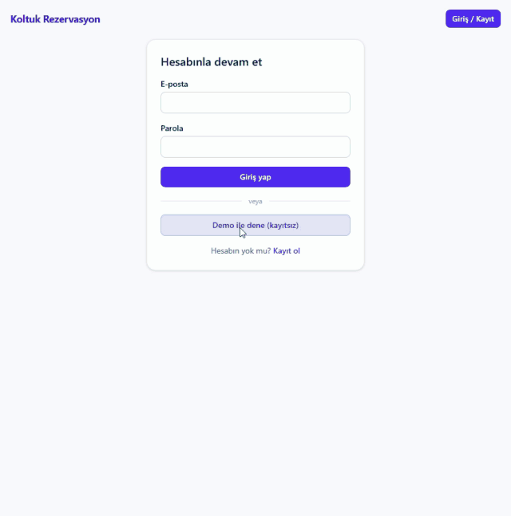
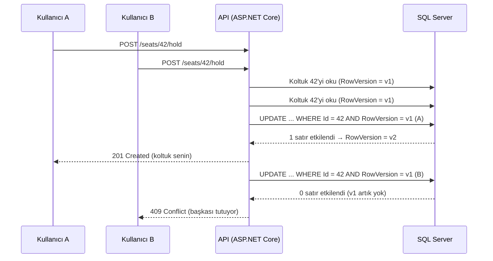

# seat-reservation-engine

[](https://github.com/mastartm/seat-reservation-engine/actions/workflows/ci.yml)

Eş zamanlılık odaklı koltuk/randevu rezervasyon motoru. Temel soru: **iki kişi aynı koltuğu aynı anda almaya çalışırsa ne olur?**

> Cevap: tam biri başarılı olur, diğeri `409 Conflict` alır. Gerçek SQL Server üzerinde 300 paralel istekle de böyle
> ([sonuçlar aşağıda](#eş-zamanlılık-sonuçları)); otomatik testi: [`ConcurrencyTests`](tests/SeatReservation.Api.Tests/ConcurrencyTests.cs),
> mekanizma: [`docs/ARCHITECTURE.md`](docs/ARCHITECTURE.md) §3.

> **Canlı demo: https://seat-reservation-engine.vercel.app** ("Demo ile dene" düğmesi kayıtsız giriş yaptırır.)
> Ücretsiz katmanlarda çalışır (Vercel + Render + Azure SQL): **kullanılmayınca API uyur, ilk açılış ~50 saniye sürebilir**,
> veritabanı da boşta duraklayıp ilk bağlantıda uyanır. Demo herkese açıktır; koltuklar başka ziyaretçilerce alınmış olabilir.
> Canlı kurulum adımları: [`docs/DEPLOY.md`](docs/DEPLOY.md). Yol haritası: [`docs/ROADMAP.md`](docs/ROADMAP.md).



<sub>Demo girişi → koltuk tutma ve 10 dakikalık geri sayım → satın alma onayı → başka bir koltukta vazgeçme.</sub>

## Eş zamanlılık sonuçları

Tek bir koltuğa N kullanıcı **aynı anda** istek atar (her satır 3 tur). Beklenen: tur başına tam 1 adet `201 Created`,
kalanı `409 Conflict`, başka hiçbir cevap yok.

| Eş zamanlı kullanıcı | Tur | 201 (kazanan) | 409 (çakışma) | Beklenmeyen (5xx vb.) | Gecikme p50 | p95 |
|---:|---:|---:|---:|---:|---:|---:|
| 10 | 3 | 3 | 27 | 0 | 17 ms | 101 ms |
| 50 | 3 | 3 | 147 | 0 | 30 ms | 37 ms |
| 100 | 3 | 3 | 297 | 0 | 48 ms | 96 ms |
| 200 | 3 | 3 | 597 | 0 | 99 ms | 207 ms |
| 300 | 3 | 3 | 897 | 0 | 254 ms | 344 ms |

Çoklu koltuk senaryosu: 200 kullanıcı, 20 koltuktan rastgele birini seçer → seçilen 20 farklı koltuğun **her biri için tam 1 kazanan**
(20 adet 201, 180 adet 409, beklenmeyen 0).

Ölçüm koşulu (dürüst not): SQL Server 2022 konteyneri, API ve istemci betiği **aynı makinede**
(Docker Desktop, Windows). Gecikmeler üretim ağını yansıtmaz, göreli okunmalıdır; doğruluk sonucu (tam 1 kazanan) ise
makineden bağımsızdır. Yeniden üretmek için: `docker compose up -d --build` sonra `python -X utf8 scripts/concurrency_load_test.py`
([betik](scripts/concurrency_load_test.py)). Otomatik testler ayrıca 100 paralel istekle 5 tur koşar: yerelde SQLite'ta, CI'daki `sqlserver` işinde gerçek SQL Server 2022'ye karşı.

## Neden böyle tasarlandı?



* **Kilit yerine iyimser eş zamanlılık (`RowVersion`):** İki istek de koltuğu "boş" okur; yarışı veritabanı tek bir `UPDATE ... WHERE RowVersion = ...` ile
  çözer. Uygulama kodu yarışı kazanmaya çalışmaz ve satırları kilitleyip bekletmez, kaybeden hemen `409` alır.
* **İş kuralları domain'de:** koltuk durum makinesi (Boş → Tutuldu → Satıldı) `Seat` entity'sinin içinde; controller'da iş mantığı yok. Kural
  `Domain.Tests` ile veritabanı olmadan sınanır.
* **Süre dolumu sunucuda:** tutmalar 10 dakika sürer, bir `BackgroundService` süresi dolanları serbest bırakır. Arayüzün geri sayımı yalnızca
  göstergedir; sunucu saatiyle düzeltilir, süreyi uygulayan taraf sunucudur.
* **Her cevap bilinen bir cevap:** benzersiz index ihlali (aynı e-postayla eş zamanlı kayıt) bile 500 değil 409'dur; veritabanı hata numarası
  (2601/2627) çevrilir.
* Tüm kararlar, reddedilen alternatifler ve bilinen sınırlar: [`docs/ARCHITECTURE.md`](docs/ARCHITECTURE.md).

## Teknoloji
.NET 8, ASP.NET Core Web API, EF Core, SQL Server, JWT, xUnit, Docker, GitHub Actions. Arayüz: React 19, TypeScript, Vite, Tailwind CSS, Vitest.

## Mimari (katmanlı)
```
src/SeatReservation.Domain          iş kuralları, entity'ler (hiçbir şeye bağımlı değil)
src/SeatReservation.Application     use-case'ler, arayüzler
src/SeatReservation.Infrastructure  EF Core, JWT, parola özetleme
src/SeatReservation.Api             HTTP katmanı, arka plan servisi
tests/SeatReservation.Domain.Tests  domain birim testleri
tests/SeatReservation.Api.Tests     gerçek HTTP hattı üzerinden entegrasyon + eş zamanlılık testleri
web/                                React arayüzü (koltuk haritası, tut/onayla + geri sayım, Rezervasyonlarım)
```
Kararlar ve gerekçeleri: [`docs/ARCHITECTURE.md`](docs/ARCHITECTURE.md). Mülakat soruları: [`docs/INTERVIEW.md`](docs/INTERVIEW.md).

## Çalıştırma
```bash
cp .env.example .env      # örnek değerleri kendine göre değiştir (JWT_KEY, parolalar)
docker compose up --build
```
* **Arayüz: http://localhost:3000** (nginx, `/api`'yi API'ye iletir). `.env.example`'daki `DEMO_ENABLED=true` ile örnek
  etkinlikler gelir ve **"Demo ile dene"** düğmesi kayıtsız giriş yaptırır.
* Swagger: http://localhost:8080/swagger
* Sağlık: http://localhost:8080/health
* `.env.example` içindeki `ADMIN_EMAIL`/`ADMIN_PASSWORD` ile giriş yapınca (Swagger → `POST /api/auth/login` → **Authorize**) etkinlik oluşturabilirsin.

### Arayüzü geliştirme modunda çalıştırma
```bash
docker compose up -d db api          # API + SQL Server (DEMO_ENABLED=true önerilir)
cd web && npm ci && npm run dev      # http://localhost:5173, /api isteklerini localhost:8080'e yönlendirir
```

## API özeti
| Uç | Kim | Ne yapar |
|---|---|---|
| `POST /api/auth/register`, `POST /api/auth/login` | herkes | Kayıt (rol: User) / giriş, JWT döner |
| `POST /api/auth/demo` | herkes (yalnızca `Demo__Enabled=true`) | Tek kullanımlık misafir hesabı açar, JWT döner |
| `GET /api/auth/me` | giriş yapmış | Token'daki kimlik |
| `POST /api/events` | Admin | Etkinlik + koltuk ızgarası oluşturur |
| `GET /api/events`, `GET /api/events/{id}/seats` | herkes | Etkinlikler, koltuk haritası |
| `POST /api/seats/{id}/hold` | giriş yapmış | Koltuğu 10 dk tutar (başkasındaysa 409) |
| `POST /api/reservations/{id}/confirm` | hold sahibi | Satın almayı onaylar |
| `POST /api/reservations/{id}/cancel` | hold sahibi | Tutmadan vazgeçer, koltuk hemen boşalır (başkasıysa 403, olmayan 404, onaylanmış/süresi dolmuş/zaten iptal 409) |
| `GET /api/reservations/mine` | giriş yapmış | Rezervasyonlarım |

## Test
```bash
dotnet build
dotnet test
cd web && npm ci && npm test        # arayüz bileşen testleri (lint: npm run lint, derleme: npm run build)
```
Testler Docker gerektirmez (entegrasyon testleri varsayılan olarak SQLite dosyası kullanır; `TEST_SQLSERVER_CONNECTION` verilirse gerçek SQL Server'a bağlanır, CI'daki `sqlserver` işi eş zamanlılık testlerini böyle koşar: `ARCHITECTURE.md` §3). Şu an: 31 domain + 68 entegrasyon + 40 arayüz testi.
Gerçek SQL Server'a karşı eş zamanlılık ölçümü ayrıca [`scripts/concurrency_load_test.py`](scripts/concurrency_load_test.py) ile yapılır (sonuçlar yukarıda).
